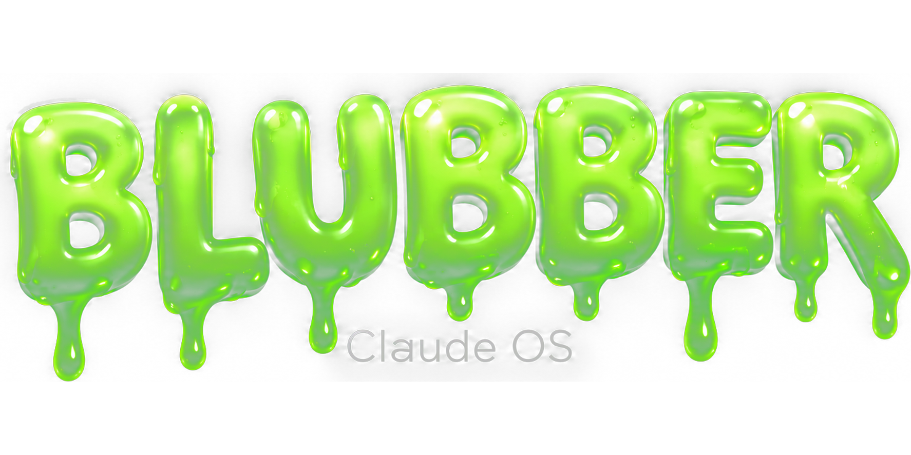
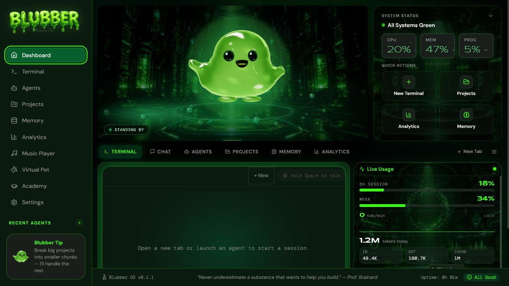
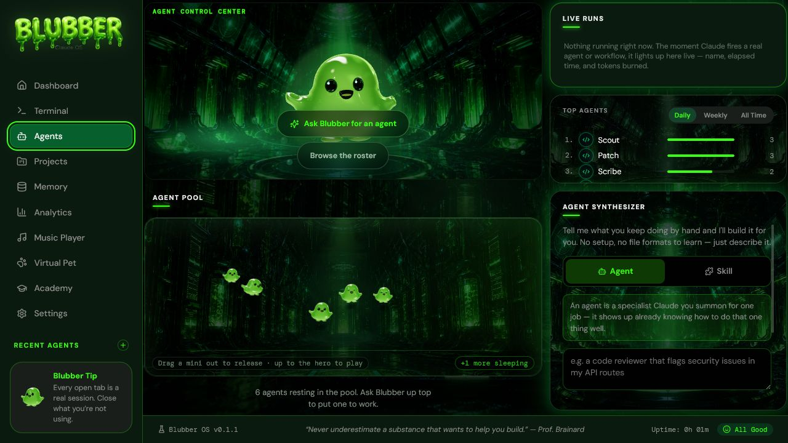

<div align="center">



# Blubber OS

**A living desktop companion for Claude Code.**

Blubber is a 3D character who lives on your machine, watches your real Claude Code activity, and turns it into a world: live dashboards, agents at workstations, a real terminal, analytics, music, a pet. Your agent work, with a face.

[Download Blubber for Windows](https://github.com/Dameboll/Blubber-OS/releases/download/v0.1.5/Blubber.Setup.0.1.5.exe) · [Get the Starter Kit](https://flubberos.myshopify.com/products/blubber-starter-kit)

**v0.1.5 Early Access:** the Windows installer is not code-signed yet. Windows may show an “unrecognized app” warning; choose **More info → Run anyway** to continue.

Blubber updates itself from v0.1.3 onward. If you are on 0.1.0–0.1.2, install this one by hand once — those builds shipped before the updater existed.



</div>

---

## What this is

Claude Code is a terminal. Powerful, but it looks like a log file. Blubber-OS is a desktop app that sits on top of your existing Claude Code setup and gives it a body.

Once you connect a workspace, it reads the transcripts Claude Code already writes to `~/.claude/projects/` and turns them into live, real data. Token usage comes from your actual sessions, the activity feed comes from your actual tool calls, and terminal tabs run the actual `claude` CLI. Before you connect, the app stays isolated and uses an obvious bundled placeholder workspace. Blubber reacts to all of it in real time, rendered live in 3D through one shared WebGL host.

The Community Edition in this repo is the full app. Free, with no feature gates on the shell. Connect an existing Claude Code workspace for real data, start from a clean slate, or look around the bundled placeholder workspace before connecting anything.

## The screens

| Screen | What it does |
|---|---|
| **Dashboard** | Hero Blubber, system status, quick actions, a terminal preview, and a live usage pill row fed by your real session data. |
| **Terminal** | Real PTY terminal tabs running the `claude` CLI, streamed over a local WebSocket into xterm.js. Tabs persist across navigation, and the terminal can expand across the dashboard when you need more room. |
| **Agents** | An agent control center. Spawn agents, watch them work at mini workstations, see a live activity feed and your top agents ranked from real usage. |
| **Projects** | Your actual project folders, sorted by real recency. Add any repository container with the native folder picker; saved folders survive app restarts. |
| **Analytics** | Token usage, tool runs, and trends rolled up from your indexed `~/.claude` transcripts into local SQLite. Real numbers or an honest "not enough data yet", never filler. |
| **Memory** | Surfaces the identity and memory files your Claude Code setup already keeps (`~/.claude/USER.md`, `PERSONA.md`, `SOUL.md`). |
| **Music** | A local music player with EQ and an audio-reactive Blubber visualizer. Drop tracks in the `music/` folder. |
| **Pet** | A virtual pet Blubber with real needs, care streaks, and quests, backed by its own SQLite store. Comes with an arcade (Snake, Pong, Connect Four, Memory Match, Reaction Tap, Blubber Toss). |
| **Academy** | The in-app course. Ships locked in v1 with a waitlist. See [Paid extras](#paid-extras) below. |
| **Settings** | General settings, reduce-effects toggle, the Starter Kit installer, replay setup, and a master reset. |



## Requirements

- **Windows 10/11, x64.** The installer is Windows-only for now.
- **Claude Code is optional at first launch.** If it is missing, Blubber can run the official installer for you or let you explore first.
- **Node.js 20+ and npm are only required when building from source.** The packaged desktop installer is self-contained.

## Install on Windows

1. [Download the v0.1.5 installer](https://github.com/Dameboll/Blubber-OS/releases/download/v0.1.5/Blubber.Setup.0.1.5.exe).
2. Run it. During Early Access, Windows SmartScreen may require **More info → Run anyway** because the installer is not code-signed yet.
3. Open Blubber and scan your Claude Code workspace. If Claude Code is not installed, choose **Install it for me** or **Look around first**.

## Build from source

```bash
git clone https://github.com/Dameboll/Blubber-OS.git
cd Blubber-OS
npm install
npm run dev
```

Open [http://localhost:3000](http://localhost:3000). No account, API key, or cloud setup is required for the core app.

**If port 3000 is taken:** `PORT=3001 npm run dev` (the server will tell you the same thing if it hits the conflict).

**If `npm run dev` throws a `NODE_MODULE_VERSION` mismatch:** the postinstall step rebuilds the two native modules (better-sqlite3, node-pty) for Electron on machines that have a native build toolchain. Flip them back to your system Node with:

```bash
npm run rebuild:system-node
```

### Desktop app

The browser tab is the default development experience, but the desktop shell and fail-closed Windows release pipeline are included:

```bash
npm run electron:dev     # run the app in an Electron window
powershell -ExecutionPolicy Bypass -File scripts/release.ps1
```

The release script type-checks, builds from scratch, switches native modules to Electron’s ABI, verifies they load, packages the NSIS installer, scans the package for private build paths, and writes a SHA-256 checksum.

## First run

1. **Intro cinematic.** Blubber forms up on a small stage, once, ever. Skippable at any time, and skipped entirely under `prefers-reduced-motion`.
2. **Scan your setup.** Blubber checks for `~/.claude` on your machine:
   - **Found with history:** one click injects it. The indexer scans your transcripts and the dashboard lights up with your real stats.
   - **Found but empty:** clean slate, straight to the dashboard. Your data shows up as you use Claude Code.
   - **Not found:** run the official Claude Code installer inside Blubber, install it yourself, or look around first.
3. **Dashboard.** From then on the app boots straight in.

You can replay the whole setup flow any time from Settings.

## Before you connect a workspace

Blubber uses a bundled placeholder dataset so a new installation has something useful to explore without reading or writing a real Claude workspace. Once you inject your setup, every stats and activity surface switches permanently to your local data.

## Configuration

The core app needs zero environment variables. There are exactly two, both optional, both for the Academy waitlist cloud sync:

```bash
cp .env.example .env.local
```

| Variable | Purpose |
|---|---|
| `NEXT_PUBLIC_SUPABASE_URL` | Supabase project URL for the hosted waitlist. |
| `NEXT_PUBLIC_SUPABASE_ANON_KEY` | The public anon key (safe to expose by design; RLS only allows inserts). |

Without them, waitlist signups fall back to a local SQLite table and everything else works exactly the same.

## Paid extras

The app in this repo is free and complete. Two optional products exist on top of it:

- **Starter Kit ($39.99).** A starter `CLAUDE.md`, 10 agents, 10 skills, 8 commands, 4 guides, and a project scaffold. Extract the download, then point Settings → General → Starter Kit at the folder containing `kit-manifest.json`; Blubber backs up conflicts and installs the selected files into `~/.claude`. **[Get the Starter Kit](https://flubberos.myshopify.com/products/blubber-starter-kit).**
- **Blubber Academy ($99 All Access tier).** A hands-on in-app course for going from "I have Claude Code installed" to actually running agents. Currently waitlist-only; it ships bundled with All Access and is never sold standalone. Join the waitlist from the Academy tab in the app.

Neither is required. The Community Edition is not a trial.

## Security notes

This app runs a local server with a real terminal attached, so the boundaries are deliberate and worth knowing:

- **Loopback only.** The server binds the literal `127.0.0.1`, not `localhost` (which can resolve elsewhere). It is unreachable from other devices on your network.
- **Token-authed terminal socket.** The PTY WebSocket requires a per-process random token on every connection, compared with a timing-safe check. The token is handed out only through a same-origin endpoint that foreign pages cannot read, so a malicious tab in your browser cannot drive your terminal.
- **Sessions die with the socket.** If a tab or connection disappears, its PTY sessions are killed rather than orphaned.
- **Local data.** Packaged builds keep mutable state in Blubber’s per-user data directory; source builds use the repo-local `data/` directory. The app reads `~/.claude` transcripts to build local SQLite indexes. It modifies your Claude setup only when you explicitly run the Starter Kit installer, and that flow backs up conflicts before copying.
- **User-triggered actions stay explicit.** Terminal tabs run the real `claude` CLI. The optional Claude Code installer invokes the official npm package install. Store and documentation links open in your normal browser.
- **Network calls.** Core indexing and dashboards are local. The optional Academy waitlist sends the email you enter to Supabase when the public waitlist variables are configured.

## FAQ

**Does this replace Claude Code?**
No. It's a companion. Claude Code does the work; Blubber-OS is the living skin on top of it. The terminal tabs literally run your installed `claude` CLI.

**Does it send my code or transcripts anywhere?**
No. Indexing is local, the database is local, the server only listens on loopback. See the security notes above.

**My dashboard is empty. Broken?**
Probably just a fresh `~/.claude`. Stats build up as you actually use Claude Code. If you have history and it still looks empty, re-run the inject from Settings.

**Mac or Linux?**
Not yet. Windows first. The code is closer to portable than not (the PTY layer already has a POSIX branch), so if you want to champion a port, open an issue.

**Is Blubber himself open source?**
The code is Apache-2.0. The character is not; see below.

**Something's broken.**
[Open an issue](https://github.com/Dameboll/Blubber-OS/issues). The bug template takes two minutes.

## Contributing

PRs welcome. Read [CONTRIBUTING.md](CONTRIBUTING.md) first; the short version is: run the e2e suite before you submit, and leave the brand assets alone.

## License

Code is licensed under [Apache-2.0](LICENSE).

**Brand assets are not.** The Blubber character, the logo, and the wordmark (everything in `public/brand/`, plus the character design itself) are not covered by the code license and may not be reused commercially. Fork the code, build on it, ship things with it. Just don't ship Blubber's face as your product.
